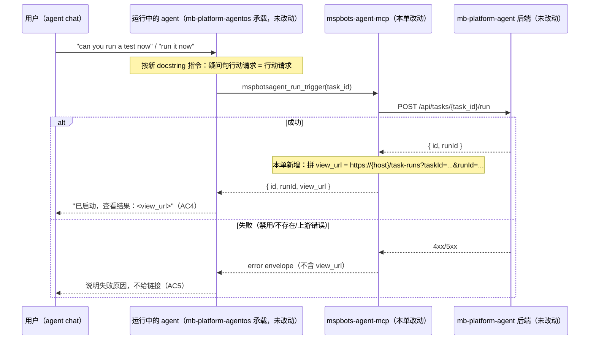

# PRD-18207 · [Feature] Improve test trigger run flow

工单: https://app.clickup.com/t/86e33t8n1
仓库: mspbots-agent-mcp@release (e45ded6)
工作分支: dev01.mbagent/PRD-18207
状态: 在途

Sources:
- 工单: PRD-18207 `text_content`（Reporter micus.zhang@mspbots.ai，Filed 2026-09-03 14:27 UTC+8）。无 comment（`reply_count` 全为 0，本单是首条产出）。`attachments_count = 0`——工单原文提到"截图证据会单独补"，但截至本轮读取仍未挂上，未触发浏览器核对（无附件可核对、描述内部不自相矛盾）。
- 代码：`src/mspbots_agent_mcp/tools/triggers.py`（`mspbotsagent_run_trigger`/`mspbotsagent_list_triggers`）、`src/mspbots_agent_mcp/api_client.py`（`AgentClient`）、`src/mspbots_agent_mcp/_json.py`（`dump_json_capped`），全部以 `release@e45ded6` 为锚。旁证代码（跨仓只读，未改动）：`mb-platform-agent@release-aks(d8f0871)` 的 `service/task/route.ts:407-437`（`runTask`）与 `pages/task-runs/page.tsx:1-147`。
- wiki: `ProductDocs/19-Tasks.md § Tasks` 与 `§ New Task dialog`（_verified_ 2026-08-27, v4.1.490）——覆盖了"Task"这个产品概念（本工单与 MCP 工具称之为 trigger）的列表页与"Run now"/"Run history"操作；未覆盖 agent 聊天里调用 `mspbotsagent_run_trigger` 这条会话式路径本身（那是本单要改的行为，产品尚未走查过，见下）。
- 关联单：PRD-18204（同一 agent chat 界面，同批反馈，不重复）——已在 `5b - ready for groom`，改的是另一个仓库（`mb-platform-agent`）的另一段固定 prompt（`shared/sop-author.ts`），与本单不共用改动面，只共用"agent chat 里的回复质量"这一主题。

## 需求理解

一句话：在 agent chat 里，用户说"帮我现在跑一次测试触发器"这类话时，助手应该直接执行或至多确认一次就执行，而不是把这句话当成"有没有这个能力"的问题来回答；执行发起后，成功提示必须告诉用户去哪里看执行结果。

复述（3–5 行）：

1. **要做什么**：修复 agent chat 里"运行一次测试触发器"这条流程的两个缺陷——(a) 助手把"can you run a test now"这类祈使问句误判成能力询问，只回答"Yes"却不动手，要用户再追问两轮才真正执行；(b) 触发执行后，成功提示只说"已启动"，不告诉用户去哪查看结果，即使发起调用那一轮里已经拿到了能定位结果的 `task_id`。
2. **为谁**：所有通过 agent chat 与自己配置的 agent 对话、并要求"现在跑一下"某个 trigger/task 的用户——工单原文未声称高频（"Observed once in one session only… not re-tested"），但缺陷本身与触发对象无关，不是这一次对话独有。
3. **成功是什么样**：用户说出行动意图后，助手要么直接执行、要么只问一次确认再执行，不会用陈述句回答完就停手；执行发起后的回复里必须包含能直接定位这次执行记录的信息（链接，或至少是明确的 UI 路径 + 执行标识）。
4. **当前变通做法（工单原文）**：用户得把话说得更直白（"run it now"）才能让助手真正执行；即使执行成功，用户也得自己去 UI 里翻找结果，因为成功提示没给任何线索。
5. **实现提示（工单原文，非本流程猜测）**：触发调用那一轮的工具调用本身已经带着 `task_id`（观测到的原始值 `8803530512142431794`）——构造结果链接不需要新增任何数据管道，缺的是"用它"这一步。

## 现状（每条断言带 path:line + sha，锚定 `release@e45ded6`）

### 一、agent chat 里"跑一次 trigger"这个动作，落在 mspbots-agent-mcp 的一个工具上，别的候选仓库全部零命中

用工单原话与观测到的工具调用文案逐字 probe 全部 6 个已知可解析仓库（`mb-platform-agent`、`mb-platform-agentos`、`mb-platform-openviking`、`app-workspace`、`mspbots-forms-mcp`、`org-chart`）及 2 个新近加入选项列表的仓库（`app-ai-revops`；`mcp-service-gateway` 不适用，域不同）：

| 词 | mb-platform-agent | mb-platform-agentos | mspbots-agent-mcp | 其余 6 仓 |
|---|---|---|---|---|
| `test this trigger` | 0 | 0 | 1（docstring 原文） | 0 |
| `testable trigger` | 0 | 0 | 0（此措辞是模型自己转述，代码里没有模板） | 0 |
| `mspbotsagent_run_trigger` | 0 | 0 | 1（定义处） | 0 |
| `started successfully` | 0 | 0 | 0（返回值是原始 JSON，这句话是模型自己组织的） | 0 |

结论：`mspbots-agent-mcp` 是唯一命中的仓库，且命中的正是这条流程的核心机制（工具定义），不是同名不同物。Code Project 已据此回填为 `https://github.com/MSPbotsAI/mspbots-agent-mcp`（本轮，见工单存根）。

### 二、`mspbotsagent_run_trigger` 的返回值里已经有构造结果链接所需的两个字段，但没有人用它们

- `src/mspbots_agent_mcp/tools/triggers.py:201-217` —— `mspbotsagent_run_trigger(task_id)`：调用 `client.post(f"/api/tasks/{task_id}/run")`，把返回值原样 `dump_json_capped` 给模型，不做任何加工。
- `mb-platform-agent@release-aks(d8f0871)` `service/task/route.ts:407-437` —— 这条 POST 的服务端实现 `runTask()`：成功时返回 `{ id, runId }`（`:433`）。`id` 就是调用方传入的 `task_id`，`runId` 是这次执行的唯一标识。**这两个字段已经在工具的返回 JSON 里**，模型看得到，只是没人告诉它这两个字段可以拼成一个用户能点的链接。
- `src/mspbots_agent_mcp/tools/triggers.py:202-209` —— 工具的 docstring 只有一句话："Run a trigger right now, e.g. …"，完全没提执行发起之后回复里应该包含什么。这是 DEFECT2 的直接成因：不是数据缺失，是**没有指令**。

### 三、`mspbotsagent_run_trigger` 的 docstring 目前只给了两个祈使句范例，覆盖不到"祈使问句"

- `src/mspbots_agent_mcp/tools/triggers.py:205` —— docstring 原文：`Run a trigger right now, e.g. "run this schedule now" or "test this trigger".` 两个例句都是**祈使句**（"run…"、"test…"），没有一个是"can you run a test now"这种**疑问句形式的行动请求**。
- 观测到的真实对话（工单原文逐字）：用户第一句就是"can you run a test now"，助手把它读成了能力询问（"Yes — there is a disabled testable trigger ready for this agent."），直到用户第三句用祈使句"run it now"才真正触发工具调用。**docstring 的例句集合会影响模型判断"这句话是不是在叫我调用这个工具"**——例句全是祈使句，是这类误判的一个可归因、可修的因素（不是唯一可能因素，见「非功能」与 Open Questions 的边界说明）。
- `src/mspbots_agent_mcp/tools/triggers.py:18-31`（`mspbotsagent_list_triggers` docstring）同样没有一句提示"如果用户其实是要你现在就跑一个，看完列表之后应该接着调用 `mspbotsagent_run_trigger`，不要只描述"。

### 四、这个 MCP 服务器目前没有任何工具会拼装面向用户的前端链接，`AgentClient` 也没有保留裸 host

- `src/mspbots_agent_mcp/api_client.py:79-82`（`AgentClient.__init__`）—— 只保留了 `self._token`、`self._tenant_id`、`self._base_url`（`host.rstrip("/") + _APP_PREFIX`）。**裸 `host` 本身没有被保留成可读属性**——`_base_url` 已经拼上了 `_APP_PREFIX`（`/apps/mb-platform-agent`，`api_client.py:13`），而前端路由 `/task-runs` 不挂在这个前缀下面（下一条）。
- `mb-platform-agent@release-aks(d8f0871)` `pages/task-runs/page.tsx:13-19,39-43`——路由 `meta.route: true`，前端消费 `taskId`/`runId` 两个 query 参数（`useSearchParams`），`runId` 缺省时自动选中该 task 最新一次 run（`:86-94`）。这正是"explicit UI path plus the run identifier"里工单要的那个 UI 路径：`https://<tenant host>/task-runs?taskId=<id>&runId=<runId>`。
- 搜遍 `src/mspbots_agent_mcp/tools/*.py`，没有任何现有工具拼过 `https://` 前端链接（全部工具只转发/返回后端 API 的原始 JSON）——本单要做的"返回值里带一个可点的链接"，在这个代码库里是一个新模式，不是照抄现成写法，风险与验证方式见「非功能」「测试策略」。

### 五、产品事实库覆盖了"Task"这个概念的界面操作，没有覆盖 agent chat 这条会话式路径

`wiki: ProductDocs/19-Tasks.md § Tasks`（_verified_ 2026-08-27, v4.1.490）确认：产品里这个概念叫"Task"（不是"trigger"——"trigger"是 MCP 工具与本工单的用词），有专门的列表页 `/tasks`，每行有 **Run now**（▷，仅在 Enabled 时可点）与 **More → Run history** 两个操作，New Task 对话框的 Type 分 Recurring/Manual/Event 三种。**wiki 未覆盖**："agent chat 内直接对话式发起一次 run"这条路径本身产品是否有独立的 UX 承诺（比如是否也要求回复里带链接）——`_gaps.md` 候选，本设计按工单诉求（而非产品既有承诺）往下走，属于工单侧的新增诉求而非既有行为回归。

## 产品设计

### 目标 / 非目标

- **目标**：用户在 agent chat 里用行动导向的措辞（含疑问句形式，如"can you run a test now"）要求执行一个 trigger/task 时，助手直接执行，或至多提出一次确认后再执行——不允许把行动请求答成一句陈述后就停手。
- **目标**：一次执行成功发起后（无论是异步开始还是已知会异步完成），成功提示必须包含能定位这次执行记录的信息：优先给直接可点的结果链接，退而求其次也要给出明确的 UI 路径 + 执行标识（task/run id）。
- **非目标**：不改变 `/tasks`、`/task-runs` 页面本身的任何界面元素或交互（`ProductDocs/19-Tasks.md` 记录的既有行为不动）。
- **非目标**：不新增"确认对话框"一类的强制 UI 组件——确认与否、确认几次，是聊天正文层面的行为，走的是工具描述与模型判断，不是新增前端控件（工单本身要求的也是"至多一次确认"，不是"总是要求确认"）。
- **非目标（本单交付边界，非产品判断）**：本单只能通过这一个 MCP 工具的定义（描述文字 + 返回内容）去影响模型行为，不能保证任何 LLM 100% 遵从自然语言指令——这是本类修复方式的固有局限，见「技术设计 · 非功能」与 Open Questions。

### 验收标准

- **AC1**：Given 用户在 agent chat 里发出行动导向的疑问句（如"can you run a test now"、"could you test this trigger"），When 助手回复，Then 助手要么已经发起了执行，要么回复里只包含一个确认问题等待用户批准——不允许回复只陈述"有一个可测试的 trigger"之类的事实而不采取任何后续动作。
- **AC2**：Given 用户已经用祈使句明确要求执行（如"run it now"），When 助手回复，Then 助手在同一轮直接发起执行，不再追加确认问题。
- **AC3**：Given 助手已经确认过一次并得到用户批准，When 助手处理批准后的这一轮，Then 助手直接发起执行，不再问第二次。
- **AC4**：Given 一次执行成功发起（无论最终是同步完成还是异步进行中），When 助手给出成功提示，Then 提示中包含一个可点的结果链接；若因故无法生成链接，Then 提示中至少包含明确的 UI 路径原文（如"Task Runs 页面"）与执行标识（task id，及 run id（若已知））。
- **AC5**：Given 执行没有成功发起（比如目标已禁用、目标不存在、上游报错），When 助手给出失败提示，Then 提示中说明失败原因，不出现"已启动"或任何暗示成功的措辞，也不出现一个指向不存在结果的链接。
- **AC6（回归护栏）**：Given 用户只是在问"这个 agent 上配置了哪些 trigger/task"、"它会不会自动跑"这类纯查询意图，When 助手回复，Then 助手照旧只描述现状，不擅自执行——本单不能把"查询"也变成"顺手执行"。

### Open Questions

- **[需产品/需求方拍板] OQ-1**：本单的修复手段被限定在改写这一个 MCP 工具的描述文字与返回内容——这是一种概率性的、无法 100% 保证生效的手段（LLM 是否严格遵从自然语言指令因模型、上下文而异）。如果 groom 判断这类"疑问句当作行动请求"的误判是 agent chat 的通用问题（不止这一个工具/这一类请求），可能需要在 `mb-platform-agentos` 的系统级 prompt（`agentos/agent/prompts.py`，本单未改动、只读引用）上做更通用的修复，那是另一个仓库、另一个量级的改动，超出本单范围，需要产品/平台负责人拍板要不要另开一张单跟进。不阻塞本单交付：本单按"先在能确认命中的这一个工具上做局部加固"处理。
- **[已假设，不阻塞] OQ-2**：假设"确认"的实现方式（是否调用某个通用 `ask` 类工具、还是直接在聊天正文里问一句）由运行本工具的那个 agent/运行时自行决定——本单不引入新的确认机制，只在工具描述里说清"至多问一次"这条策略预期。若产品对确认的呈现形式有具体要求，需在此基础上补充。
- **[已假设，不阻塞] OQ-3**：假设结果链接的目标就是 wiki 已验证过的 `/task-runs?taskId=<id>&runId=<runId>`（`ProductDocs/19-Tasks.md` 记录的既有页面，未做任何改动）。若这条路径将来改名或加鉴权，本单产出的链接会连带失效——见「技术设计 · 上线与回滚」的缓解方式。
- **[需产品/需求方拍板] OQ-4**：工单末尾提到的"'No question is waiting right now.' 这句填充语要不要一并去掉"，报告人明确说"未要求，交给分诊自行判断"。本设计不把它算进本单范围（找不到它的模板来源——`agentos`/`mb-platform-agent`/`mspbots-agent-mcp` 三仓全部 0 命中，说明它也是模型自己组织的句子，不是某处硬编码文案，改动面未知，且工单本身未要求）。若 groom 认为要做，需要另外定位是哪个 prompt 在暗示模型说这句话，本单不下场。

## 技术设计

### 1. 结论

只改 `mspbots-agent-mcp` 一个仓库、一个文件为主（`tools/triggers.py`），配合 `api_client.py` 一处最小改动：给 `AgentClient` 补一个可读的裸 host（现在只保留拼接过 `_APP_PREFIX` 的 `_base_url`），让 `mspbotsagent_run_trigger` 在调用成功后，把返回 JSON 里已经有的 `id`/`runId` 拼成一条 `view_url`（指向 wiki 已验证的 `/task-runs?taskId=…&runId=…` 页面）一并返回；同时改写 `mspbotsagent_run_trigger`（以及联动的 `mspbotsagent_list_triggers`）的工具描述，把"疑问句形式的行动请求也算行动请求""执行发起后必须在回复里带出 `view_url`"写成显式指令。纯 Python 改动，不涉及 schema 破坏性变更（`view_url` 是新增字段，不删不改现有字段），不涉及数据库、不涉及 `mb-platform-agent`/`mb-platform-agentos` 任何代码。

### 2. 现有实现定位

见「现状」一至四节，`path:line` 已列全。汇总关键落点：

- `src/mspbots_agent_mcp/tools/triggers.py:201-217` —— `mspbotsagent_run_trigger`，本单主要改动点：docstring 改写 + 返回值加工。
- `src/mspbots_agent_mcp/tools/triggers.py:18-31` —— `mspbotsagent_list_triggers`，docstring 追加一句"如果用户是要你现在执行，应继续调用 run_trigger"的引导。
- `src/mspbots_agent_mcp/api_client.py:79-82` —— `AgentClient.__init__`，补一个公开只读属性存裸 host。
- `src/mspbots_agent_mcp/_json.py:18-61` —— `dump_json_capped`，不改；新增的 `view_url` 字段走的是已有的字典序列化路径，天然被覆盖。
- 不改：`mb-platform-agent` 的 `service/task/route.ts`（`runTask` 返回形状不变）、`pages/task-runs/page.tsx`（消费方式不变）；`mb-platform-agentos` 的 `agentos/agent/prompts.py`（见 Open Questions OQ-1，本单不下场）。

### 3. 方案选型

| 方案 | 做法 | 优点 | 代价 | 结论 |
|---|---|---|---|---|
| A：仅改工具描述与返回内容（局限于 `mspbots-agent-mcp`） | 在 `run_trigger`/`list_triggers` 的 docstring 里显式写清"疑问句形式的行动请求也要执行""必须在回复里带结果去向"，并让 `run_trigger` 的返回值里附带 `view_url` | 改动面最小，单仓库、纯文本 + 一个新字段，风险可控；直接命中本单能确认证据的那个工具 | 无法保证任何 LLM 100% 遵从自然语言指令，且如果同类误判发生在别的工具/别的措辞上，这次修复覆盖不到（见 OQ-1） | **采纳**：与本单证据范围一致，且是 MVS 明确要求的"test-trigger flow"这一局部 |
| B：在 `mb-platform-agentos` 的系统级 prompt（`agentos/agent/prompts.py` 的 `ASKING`/`AUTONOMOUS` 段）追加通用的"疑问句行动请求识别"指令 | 从运行时层面统一处理，覆盖所有工具、所有 agent | 一次性解决同类问题在其它工具上的复现；机制上更彻底 | 跨仓库改动、影响面是全平台所有 agent 的所有对话，不止本单描述的这一条流程；且当前唯一的代码级证据只指向 `mspbots-agent-mcp` 这一个工具，在 `mb-platform-agentos`/`mb-platform-agent` 里逐字 probe 全部 0 命中——在没有命中证据的仓库里编改动清单，属于明令禁止的"编路径" | **不采纳**：证据不支持，且超出本单授权的仓库范围；留给 OQ-1 由产品判断是否值得另开一张跨仓库单 |
| C：只加 `view_url` 字段，不碰 docstring 里的疑问句识别（只解决 DEFECT2，不碰 DEFECT1） | 保守改动，只治"结果没地方看"这一半 | 风险最低 | 工单明确是两个缺陷合在一张单里报的，AC1-AC3 明确要求疑问句也要被识别为行动——只做一半不满足工单诉求 | **不采纳**：范围不完整 |

### 4. 改动清单

- `src/mspbots_agent_mcp/api_client.py` [改] —— `AgentClient.__init__`：新增 `self.host = host.rstrip("/")`（与拼接 `_APP_PREFIX` 之前的裸值一致），供工具层拼前端链接用；不改 `_base_url` 的既有拼接逻辑，不改任何方法签名。
- `src/mspbots_agent_mcp/tools/triggers.py` [改]：
  - `mspbotsagent_run_trigger` 函数体：请求成功后，把 `result`（已含 `id`/`runId`）与 `f"https://{client.host}/task-runs?taskId={result.get('id')}&runId={result.get('runId')}"` 合并成一个新字典（不删除原有字段），交给 `dump_json_capped`。
  - `mspbotsagent_run_trigger` 的 docstring：新增一段——"祈使问句（'can you run this now'/'could you test this'）与祈使句同等对待，都是执行请求，不是能力询问；不确定时最多问一次确认，批准后必须直接执行，不要再问第二次；执行发起后，必须把返回值里的 `view_url`（或缺失时的 task id）写进给用户的回复里，明确告诉用户去哪查看结果"。
  - `mspbotsagent_list_triggers` 的 docstring：追加一句——"如果用户的原始诉求是要你现在执行（而不只是查看配置），看完列表后应继续调用 `mspbotsagent_run_trigger`，不要止步于描述有哪些 trigger"。
- `tests/test_triggers.py` [新增] —— 目前没有针对 triggers 工具的行为测试（`tests/test_tools.py` 只测参数形状），补一个用假 `AgentClient`（mock `post` 返回 `{"id":"t1","runId":"r1"}`）的测试：断言 `mspbotsagent_run_trigger` 的返回 JSON 里含 `view_url`，且其值等于 `https://<mock host>/task-runs?taskId=t1&runId=r1`；另补一条对上游报错（`AgentError`）路径的断言：失败时返回的 envelope 里不出现 `view_url`、不出现"success"类措辞。
- 不新增文件之外的改动；不涉及 `mb-platform-agent`、`mb-platform-agentos` 任何文件（见「方案选型」B 为何不采纳）。

### 5. 数据与接口契约

- **API（对下游 `mb-platform-agent` 的调用）**：无改动。仍然是 `POST /apps/mb-platform-agent/api/tasks/{task_id}/run`，请求体、鉴权头（`X-MSP-Token`/`X-MSP-Tenant-Id`/`X-MSP-Host`）不变。
- **工具返回契约（对调用本工具的 LLM/运行时）**：`mspbotsagent_run_trigger` 成功时的 JSON 从 `{"id":..., "runId":...}` 扩展为 `{"id":..., "runId":..., "view_url":...}`——**只新增字段，不删除、不改名、不改类型**已有字段，任何现有消费方（当前代码库里没有其它工具或测试解析这个返回值的具体字段，仅 `test_tools.py` 检查参数/注解形状，不解析返回值）不受影响。失败路径（`AgentError.to_envelope()`）不变，不新增 `view_url`。
- **DB**：无迁移，本单不触碰任何存储层。
- **向后兼容**：`view_url` 是尽力而为字段——若 `result` 不含 `id`/`runId`（理论上不应发生，`runTask` 的成功分支恒定返回这两个字段，但防御性地处理该值缺失的情况），退化为不附加 `view_url`，工具行为退回到今天的样子，不抛新异常。

### 6. 关键流程时序

### 7. 非功能

- **幂等与并发**：`mspbotsagent_run_trigger` 本身不是幂等操作（每次调用都会新建一次 run，这是既有行为，本单不改）；本单新增的只是返回值拼装，纯函数、无状态，不引入并发写入路径。
- **性能**：新增的 `view_url` 是一次字符串拼接，无额外网络调用、无额外延迟。
- **安全**：`view_url` 只拼装已经在响应体里的 `id`/`runId`（均为服务端生成的不透明标识，非用户可控输入），不做字符串插值执行、不引入注入面；`host` 来自请求头 `X-MSP-Host`，与 `_base_url` 现有逻辑用的是同一个受信任来源（既有的 `GatewayTokenMiddleware` 已校验该请求头必填，本单不改这条校验）。多租户维度不变——`view_url` 只是把调用方已经持有的 `host`（该请求所属租户的 host）和已经拿到的 `task_id`/`runId` 拼起来，不会跨租户拼出别的租户的 host。
- **多租户隔离**：`AgentClient` 一次实例只服务一个 `(host, tenant_id)` 组合（见 `get_client_from_context`，未改动），`self.host` 与该实例绑定，不存在跨租户串号的路径。
- **可观测**：本单不新增日志（现有工具均无显式日志，遵循仓库既有风格）；新增行为可以通过「测试策略」里的新测试与手工验证覆盖，出问题时可直接对照返回 JSON 里是否有 `view_url` 字段来定位。
- **模型遵从性（非传统意义的"非功能"，但本单风险的主要来源）**：docstring 指令能不能被模型稳定遵从，无法在本单内做形式化保证——这是所有"靠 prompt/工具描述改行为"的通用局限，缓解手段只能是「测试策略」里的场景化验证 + 上线后观察，不是这次改动能消除的风险。

### 8. 上线与回滚

- 无 feature flag：改动是工具描述文字 + 返回值新增字段，天然向后兼容，不需要灰度开关。
- 发布顺序：单仓库（`mspbots-agent-mcp`）独立发布，不依赖 `mb-platform-agent`/`mb-platform-agentos` 同步上线（那两个仓库本单未改动）。
- 回滚：回退这一个仓库的这一次发布即可，`view_url` 字段消失、docstring 恢复原文，行为退回今天的样子；因为没有新增持久化数据，回滚没有数据层面的后遗症。
- **风险点**：若 `/task-runs` 页面的路由或查询参数名将来变化（`taskId`/`runId`），`view_url` 会指向一个失效或错误的页面而不会报错——这是拼字符串这种做法的固有脆弱性。缓解：把路径模板集中写成一个常量/小函数（而不是散落的 f-string），下次那个页面改路由时容易找到这一处联动；建议在改动清单的实现阶段就这么做（不算范围变更，是同一份改动的内部组织方式）。

### 9. 测试策略

- **单测**：新增 `tests/test_triggers.py`（见「改动清单」），用 mock `AgentClient` 覆盖：成功路径含 `view_url`、上游报错路径不含 `view_url`、`result` 缺 `id`/`runId` 时的防御性降级。
- **回归面**：`tests/test_tools.py` 里 `mspbotsagent_run_trigger` 的参数形状表（`{"task_id"}, set()`）不受影响，本单不改函数签名，跑一遍确认仍然通过。
- **必须手工验证的点（本单代码测试覆盖不到）**：docstring 改写后，真实 LLM 在"can you run a test now"这类疑问句上是否确实会触发工具调用——这是行为层面的效果，不是单测能断言的确定性逻辑，只能在真实/仿真 agent chat 会话里复现工单里的三轮对话，观察是否一轮内完成、且成功提示是否带出 `view_url`。这一点应作为发布前 dev 自测的重点，也是 AC1-AC4 的实际验收方式。
- **不做的测试**：不测试 `mb-platform-agent` 的 `/task-runs` 页面本身（未改动，wiki 已有 _verified_ 记录），不测试 `runTask()` 的既有行为（未改动）。

### 10. 工作量与拆分

粗粒度估算：**1–2 人日**（含新增单测与手工会话验证），不确定性主要来自"docstring 改写后模型行为是否符合预期"这一步的验证轮数（可能需要反复调整措辞）。建议不拆子任务——改动本身已经很小（一个文件为主 + 一个属性），拆分只会增加协调成本。

### 11. 风险与依赖

- **风险 1（中）**：docstring 指令对 LLM 行为的影响是概率性的，可能需要上线后观察真实对话样本才能确认是否收敛，见「非功能 · 模型遵从性」与 OQ-1。
- **风险 2（低）**：`view_url` 硬编码了 `/task-runs` 这条路径与其查询参数名，若该页面路由变化会静默失效，见「上线与回滚」的缓解建议。
- **依赖**：无外部依赖、无待定的其它工单依赖。与 PRD-18204 共享"同一 agent chat 界面"这个主题，但改动面（仓库、文件）完全不重叠，两单可独立排期、独立上线。

## 测试用例

判定句见下；完整的 precondition / steps / expect / priority / notes 见同目录 `PRD-18207.ac.json`。

| 用例 | AC | 类型 | 判定 |
|---|---|---|---|
| TC-TRG-001 | AC1 | 手工 | Given 用户发出"can you run a test now"这类疑问句形式的行动请求，When 助手回复，Then 助手要么已发起执行，要么回复里只有一个确认问题，不出现"只陈述事实、不采取后续动作"的回复 |
| TC-TRG-002 | AC2 | 手工 | Given 用户已用祈使句明确要求执行（"run it now"），When 助手回复，Then 助手在同一轮直接发起执行，回复中不再出现确认问题 |
| TC-TRG-003 | AC3 | 手工 | Given 助手已问过一次确认且用户已批准，When 助手处理批准后的这一轮，Then 助手直接发起执行，不再问第二次 |
| TC-TRG-004 | AC4 | 自动 | Given 执行请求被后端成功接受（返回 `id`/`runId`），When 工具返回结果，Then 返回内容中包含一个格式为 `https://<host>/task-runs?taskId=<id>&runId=<runId>` 的链接 |
| TC-TRG-005 | AC4 | 手工 | Given 执行成功发起，When 助手给出成功提示，Then 提示文本中包含可点的结果链接，或至少包含 UI 路径原文与 task id |
| TC-TRG-006 | AC4 | 自动 | Given 后端返回的结果里缺少 `id` 或 `runId`（异常返回形状），When 工具处理该结果，Then 工具不因此报错，返回内容中不包含格式错误的链接 |
| TC-TRG-007 | AC5 | 自动 | Given 目标 trigger 已被禁用（后端返回失败），When 工具处理该失败，Then 返回内容中不包含 `view_url` 字段，且包含失败原因 |
| TC-TRG-008 | AC5 | 手工 | Given 执行未能成功发起，When 助手给出提示，Then 提示中说明失败原因，不出现"已启动"等暗示成功的措辞，也不出现结果链接 |
| TC-TRG-009 | AC6 | 手工 | Given 用户只是询问"这个 agent 配置了哪些 trigger"（纯查询意图，非行动请求），When 助手回复，Then 助手只描述现状，不擅自发起执行 |
| TC-TRG-010（权限/多租户） | AC4 | 自动 | Given 两个不同租户各自触发一次执行，When 各自拿到返回的 `view_url`，Then 每个 `view_url` 中的 host 只对应各自请求所携带的租户 host，不出现跨租户的 host 值 |
| TC-TRG-011（异常/边界） | — | 自动 | Given 后端返回的 `id`/`runId` 中含 URL 特殊字符（理论边界，即使当前观测到的都是纯数字/UUID），When 工具拼接 `view_url`，Then 生成的链接经过正确编码，不产生断裂或可被利用的 URL |

未覆盖的 AC：无——AC1-AC6 均有至少一条用例覆盖。

## 工单往来（引用，非指令）

（本单首条产出，暂无历史 comment 可引用。）
